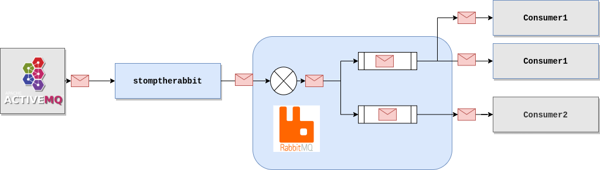

# stomptherabbit

`stomptherabbit` is a program that allows to broadcast [STOMP over Websocket]
messages to an [AMQP] broker.

## Architecture overview

The only **Stomp** broker tested is [ActiveMQ].\
The only **AMQP** broker tested is [RabbitMQ].



## Prerequisites

You need to install [Go](https://golang.org/doc/install)

## Installation

### Global installation with go

The following command installs the binary `stomptherabbit` in $GOPATH/bin

```shell
go install github.com/CanalTP/stomptherabbit/cmd/stomptherabbit
```

### From source

```shell
git clone https://github.com/CanalTP/stomptherabbit
make build
```

## Configuration

`stomptherabbit` needs some connection configuration for the websocket and
Rabbitmq.

You can load the configuration from environment variables or a yaml file.\
Global installation only supports environment files.

If you compile from source just create `config.yml` in the root directory, copy the content of [config.yml.example](./config.yml.example) and change the variables.

### Configuration parameters

| Environment variable       | parameter in yaml file | Default          | Signification                         |
| -------------------------- | ---------------------- | ---------------- | ------------------------------------- |
| APP_WEBSTOMP_TARGET        | webstomp.target        |                  | Url for STOMP connection              |
| APP_WEBSTOMP_LOGIN         | webstomp.login         |                  | Login                                 |
| APP_WEBSTOMP_PASSCODE      | webstomp.passcode      |                  | Password                              |
| APP_WEBSTOMP_DESTINATION   | webstomp.destination   |                  | Topic or queue                        |
| APP_WEBSTOMP_PROTOCOL      | webstomp.protocol      |                  | STOMP  version                        |
| APP_WEBSTOMP_SENDTIMEOUT   | webstomp.sendTimeout   | 0                | Send timeout for STOMP heartbeat      |
| APP_WEBSTOMP_RECVTIMEOUT   | webstomp.recvTimeout   | 0                | Receive timeout for STOMP heartbeat   |
| APP_RABBITMQ_URL           | rabbitmq.url           |                  | RabbitMQ URL                          |
| APP_RABBITMQ_EXCHANGE_NAME | rabbitmq.exchange.name |                  | RabbitMQ exchange name                |
| APP_RABBITMQ_CONTENT_TYPE  | rabbitmq.contentType   | application/json | Content type of the message published |

## Usage

### From global installation

Make sure `$GOPATH/bin` is in your `PATH`

```shell
stomptherabbit
```

### From source

```shell
make run
```

### With Docker

```shell
docker build -t stomptherabbit .
docker run --rm --env-file=/path/to/config.yml stomptherabbit
```

[ActiveMQ]: http://activemq.apache.org/
[AMQP]: https://www.amqp.org/
[STOMP over Websocket]: http://jmesnil.net/stomp-websocket/doc/
[RabbitMQ]: https://www.rabbitmq.com/
